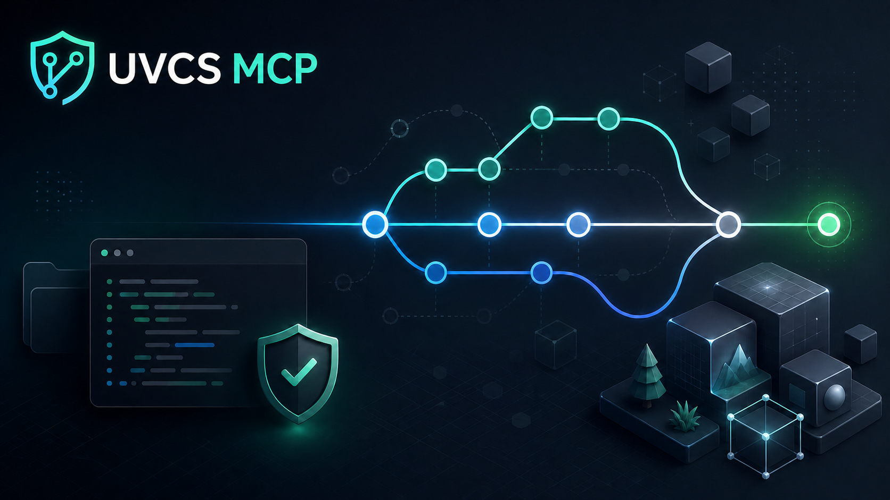

# UVCS MCP - Unity Version Control / Plastic SCM MCP Server



Safe MCP server for Unity Version Control, Unity DevOps Version Control, and Plastic SCM source-control workspaces.

UVCS MCP connects AI IDEs and coding agents to the local `cm` CLI through a fixed allowlist of documented SCM commands. It helps agents inspect source-control workspace state, prepare changes, create branches and labels, run guarded checkins, and perform merges without arbitrary shell access.

This is an alpha release. It has been tested end-to-end on Plastic SCM `10.0.16.6656`.

## Not a Unity Editor MCP

UVCS MCP is not a Unity Editor automation server. It does not control scenes, GameObjects, Play Mode, Unity packages, editor windows, builds, or runtime objects.

It works with the Plastic SCM / Unity Version Control `cm` CLI and focuses on source-control workflows: status, pending changes, branches, labels, checkins, locks, diffs, and merges.

## Quick Install

Ask your AI IDE to install this MCP server from the GitHub repository URL.

For example:

```text
Install this MCP server from https://github.com/ProAnima/unity-version-control-mcp, configure it for my Plastic SCM / Unity Version Control source-control workspace, and run uvcs_doctor.
```

Or install manually:

```bash
git clone https://github.com/ProAnima/unity-version-control-mcp.git uvcs-mcp
cd uvcs-mcp
node src/cli.js init-local --client=cursor,codex,claude-code,opencode,antigravity,kiro --workspace="D:/Repositories/YourWorkspace"
```

Restart your MCP client, then ask it to run:

```text
uvcs_doctor
uvcs_workspace_status
```

Preview config changes without writing:

```bash
node src/cli.js init-local --client=all --workspace="D:/Repositories/YourWorkspace" --print-config
```

## Manual Setup By OS

Windows:

```powershell
node src/cli.js init-local --client=cursor,codex,claude-code,opencode,antigravity,kiro,windsurf --workspace="D:\Repositories\YourWorkspace"
```

macOS:

```bash
node src/cli.js init-local --client=cursor,codex,claude-code,opencode,antigravity,kiro,windsurf --workspace="$HOME/Repositories/YourWorkspace"
```

Linux:

```bash
node src/cli.js init-local --client=cursor,codex,claude-code,opencode,antigravity,kiro,windsurf --workspace="$HOME/Repositories/YourWorkspace"
```

If `cm` is not in `PATH`, add `--cm=/path/to/cm` or set `UVCS_CM_PATH`.

## Quick Start From npm

```bash
npx -y @proanima/uvcs-mcp init --client=cursor,codex --workspace="D:/Repositories/YourWorkspace"
```

Manual MCP block:

```json
{
  "command": "npx",
  "args": ["-y", "@proanima/uvcs-mcp"],
  "env": {
    "UVCS_WORKSPACE": "D:/Repositories/YourWorkspace",
    "UVCS_MCP_MODE": "readonly"
  }
}
```

## Supported Clients

- Cursor
- Cursor global
- Codex
- Claude Desktop
- Claude Code
- OpenCode
- OpenCode global
- Antigravity
- Kiro
- Kiro global
- Windsurf

## Safety Model

- Default mode is `readonly`.
- Write tools require `UVCS_MCP_MODE=standard`.
- Critical write operations use `*_prepare` followed by matching `*_confirm`.
- Repository delete, repository rename, arbitrary `cm`, arbitrary shell execution, and raw `cm api` startup are not exposed.

## Tools

- `uvcs_doctor`
- `uvcs_workspace_status`
- `uvcs_pending_changes`
- `uvcs_branch_info`
- `uvcs_locks`
- `uvcs_unity_meta_diagnostics`
- `uvcs_style_rules`
- `uvcs_name_preview`
- `uvcs_release_plan`
- `uvcs_diff_file`
- `uvcs_update_workspace_prepare` / `uvcs_update_workspace_confirm`
- `uvcs_changeset_analytics`
- `uvcs_add_prepare` / `uvcs_add_confirm`
- `uvcs_branch_create_prepare` / `uvcs_branch_create_confirm`
- `uvcs_label_create_prepare` / `uvcs_label_create_confirm`
- `uvcs_switch_workspace_prepare` / `uvcs_switch_workspace_confirm`
- `uvcs_merge_prepare` / `uvcs_merge_confirm`
- `uvcs_checkin_prepare` / `uvcs_checkin_confirm`

## Development

```bash
npm test
npm run check
```

Run the real Plastic SCM smoke test against a disposable or safe workspace:

```bash
npm run smoke:plastic -- "D:/Repositories/YourWorkspace"
```

The smoke test creates temporary branches, labels, checkins, and a merge through MCP tools.

## Project Support

- Use GitHub Issues for reproducible bugs, client setup problems, and compatibility reports.
- Use feature requests for new SCM workflows or MCP tools.
- Do not include secrets, access tokens, private server credentials, or full proprietary logs in public issues.
- For security reports, see [Security Policy](SECURITY.md).

## Documentation

- [Install](docs/install.md)
- [Clients](docs/clients.md)
- [Security](docs/security.md)
- [Compatibility](docs/compatibility.md)
- [Automation Style](docs/automation-style.md)
- [Production Readiness](docs/production-readiness.md)
- [Troubleshooting](docs/troubleshooting.md)
- [Rules for Agents](docs/rules-for-agents.md)
- [Contributing](CONTRIBUTING.md)
- [Support](SUPPORT.md)
- [Wiki Source](wiki/Home.md)
- [Changelog](CHANGELOG.md)

## Maintainer

Ian Panaev, ProAnimaStudio, 2026. Contact: proanimastudio@gmail.com.
